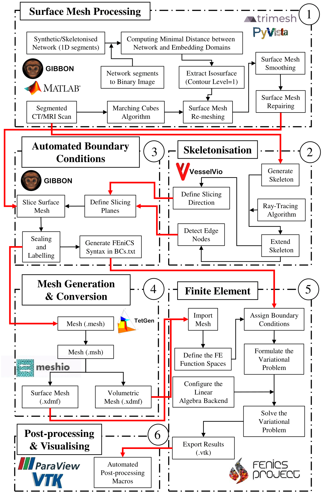

# Tube2FEM - 
Tube2FEM is a general-purpose highly-automated pipeline for flow related processes in (embedded) tubular objects

## Getting started

[Click here](https://www.gibboncode.org) 

 

The image doesn't work

Authors
-------
Tube2FEM is developed by:

  * Hani Cheikh Sleiman
  * Shiyu Wang

Licence
-------

Documentation
-------------
For an introduction to Tube2FEM, and tutorials, please refer to the [documentation](https://readthedocs.org/).

If you wish to use Tube2FEM for journal publications, please refer to the [JOSS publication](https://joss.theoj.org/papers/10.21105/joss.02089#):

Cheikh Sleiman et al., (2024). Tube2FEM: Tube2FEM: a general-purpose highly-automated pipeline for flow related processes in (embedded) tubular objects. Journal of ... https://...

Installation
------------
Tube2FEM uses multiple Python packages and MATLAB libraries (see Figure below)

Tube2FEM packages/libraries interoperability.

Contact
-------
The latest version of this software can be obtained from

  https://github.com/CheikhSleiman/Tube2FEM

Please report bugs and other issues through the issue tracker at:

  https://github.com/CheikhSleiman/Tube2FEM/issues